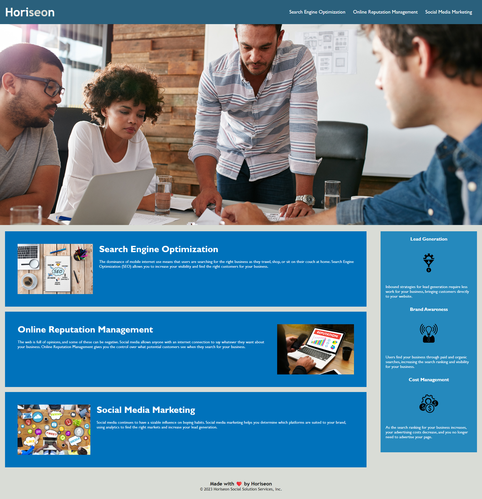

# Code Rafactoring Challenge

___

## Project Description

This is a website optimization project that consolidates repeated code, ensures all navagation links are working properly, and follows proper format and naming conventions. Comments have been included to explain how each section of the page works.

## How to run this project

Click this link to visit the site:  
[Horiseon](https://kiyodosan.github.io/UCI-BOOTCAMP-WEEK-1-CODE-REFACTORING/)

## How to use this project

The user can jump to the topic of their choosing by clicking on one of the three links found in the navigation bar located at the top right section of the page.

## Credits

&copy; 2023 Horiseon Social Solution Services, Inc.  
Tyler Odo

## License

MIT License

Copyright (c) 2023 Tyler Odo

Permission is hereby granted, free of charge, to any person obtaining a copy
of this software and associated documentation files (the "Software"), to deal
in the Software without restriction, including without limitation the rights
to use, copy, modify, merge, publish, distribute, sublicense, and/or sell
copies of the Software, and to permit persons to whom the Software is
furnished to do so, subject to the following conditions:

The above copyright notice and this permission notice shall be included in all
copies or substantial portions of the Software.

THE SOFTWARE IS PROVIDED "AS IS", WITHOUT WARRANTY OF ANY KIND, EXPRESS OR
IMPLIED, INCLUDING BUT NOT LIMITED TO THE WARRANTIES OF MERCHANTABILITY,
FITNESS FOR A PARTICULAR PURPOSE AND NONINFRINGEMENT. IN NO EVENT SHALL THE
AUTHORS OR COPYRIGHT HOLDERS BE LIABLE FOR ANY CLAIM, DAMAGES OR OTHER
LIABILITY, WHETHER IN AN ACTION OF CONTRACT, TORT OR OTHERWISE, ARISING FROM,
OUT OF OR IN CONNECTION WITH THE SOFTWARE OR THE USE OR OTHER DEALINGS IN THE
SOFTWARE.